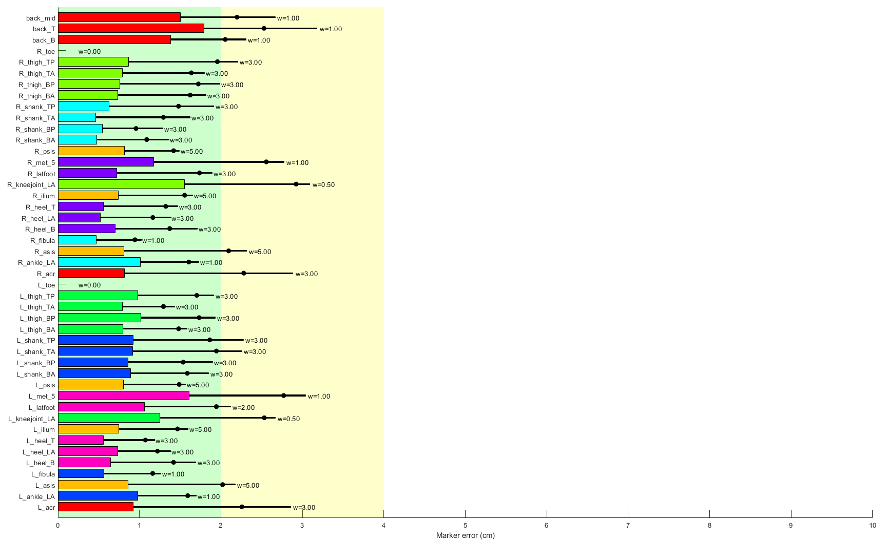

# Get marker errors from inverse kinematics

OpenSim doesn't normally output the error for each marker when you do inverse kinematics (IK). This collection of MATLAB scripts automates the process of calculating marker-wise errors. I compute absolute errors since I find those most helpful.

**Important:** the `read_trc` and `read_mot` functions rely on the readmatrix() function, which was introduced in MATLAB R2019a. If you have an older version of MATLAB, you will have to change them to use the dlmread() function instead. Sorry.

## Some useful info

This script also shows how to automate some aspects of the IK workflow using the OpenSim API. It's tedious to edit XML files by hand when you have lots of trials, or lots of subjects. If you were using this for lots of files, be sure to use *absolute* paths, not relative paths (at least in Windows, OpenSim does not handle relative paths very well).

I use MATLAB's built-in low-level file i/o functionality to directly read the data from .trc and .mot files. I find this to be much faster than relying on the OpenSim API's Table functions, though it requires a little finesse to format the results correctly. The .trc, .sto, and .mot file formats are just tab-delimited files with a specific header structure (You can open them in Excel! Or Notepad++ or Atom or your favorite text editor). See the `read_trc.m`, `read_mot.m` (which also works for .sto), and `write_sto.m` functions to see how this works.

`get_trc_columns.m` is also a very useful function for turning the wonky formatting of .trc header text into normal column headers that can be string-matched.

Very big marker errors for a trial usually mean bad scaling or a mislabeled marker in your .trc data.

## Interpreting the plot

I've also included a plotting utility called `plot_marker_errors.m` that I use as a quick spot-check of my IK results. It plots the mean, 99th percentile, and maximum value of the error for each marker, in centimeters, plus a "green zone" for good results and a "yellow zone" for mediocre results (these are of course arbitrary thresholds).  

Additionally, each marker's IK weight gets printed next to it, which makes it easy to see which markers you should up-weight or down-weight if you not happy with results!  

The color scheme in the plotting function is still tuned to my marker set, not the marker label names in the demo data presented in this repo. So you will not necessarily get the colors shown below. But it's still pretty useful. 

